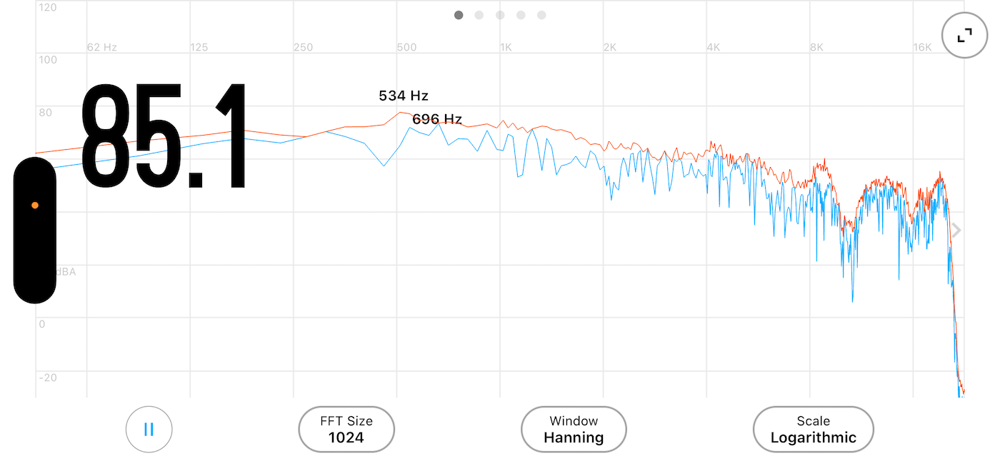
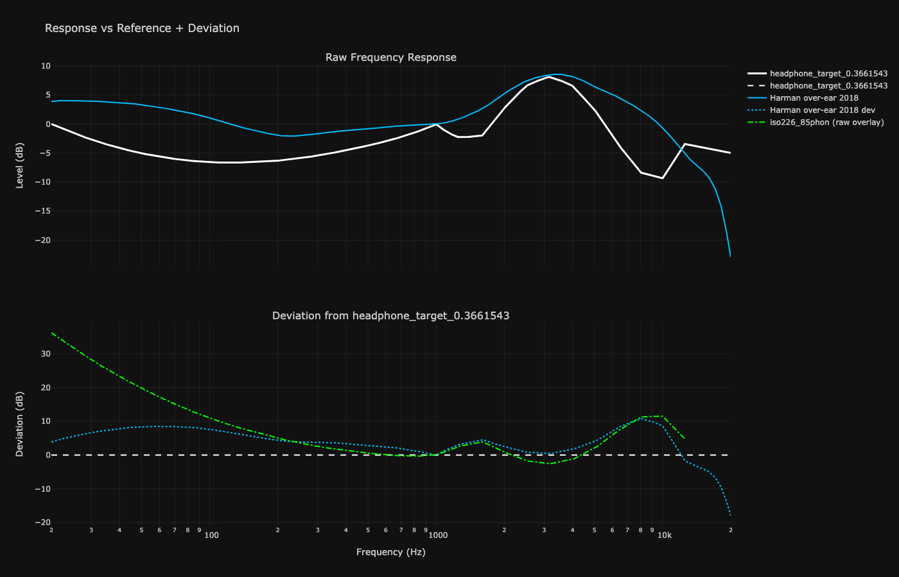

# The ISO 226:2023 Headphone Target

**A perceptually optimized EQ framework that scales with the biology of human hearing.**


Most headphone targets (such as Harman) are static averages of subjective listener preferences. This project takes a physiological approach. By deriving a target strictly from the **ISO 226:2023 equal-loudness contours**, this framework delivers a perceptually flat, energy-balanced response that minimizes auditory masking and preserves midrange clarity at natural listening volumes.

## Table of Contents
1. [The Theory](#-the-theory-under-the-hood)
2. [The Calibration Ritual](#-the-calibration-ritual-the-sandwich)
3. [The Included Curves](#%EF%B8%8F-the-included-curves)
4. [The Toolkit](#%EF%B8%8F-the-toolkit)
    * [gentarget.py](#1-gentargetpy--custom-iso-target-generator)
    * [volume_match.py](#2-volume_matchpy--psychoacoustic-loudness-matcher)
5. [Quick Start](#-quick-start)
6. [Harman Target Deviation](#headphone-target-vs-harman-target-deviation)
7. [What I learned](#what-i-learned)

## 🧠 The Theory: Under the Hood

### 1. The Biological Baseline (ISO 226:2023)

Human hearing is non-linear; we are highly sensitive to mid-frequencies (where human speech lives) and significantly less sensitive to sub-bass and extreme treble. This target uses the latest ISO 226:2023 data at an **85-phon reference level** to map exactly how much acoustic pressure is required at every frequency for the brain to perceive the spectrum as equally loud.

### 2. Pinna Gain Inversion & Energy Balancing

Applying raw equal-loudness contours directly to headphones results in a skewed response because headphones bypass the outer ear, lacking the natural acoustic interaction of a physical room. To correct this, the target **inverts the sensitivity data above 1 kHz** to properly reconstruct the required pinna gain area.

Combined with **adaptive shaping and spectral tilt**, this mathematically balances the total acoustic energy across the frequency spectrum while maintaining the integrity of the ISO baseline.

### 3. The "Optimal" Coefficient: 0.3661543

Bass tuning is a battle against **auditory masking**, where excessive low-frequency energy bleeds into and obscures the lower midrange. To solve this, I defined a boundary range between two extreme profiles:

* **`headphone_target_0.00.csv`**: The "Clinical Floor"—the absolute mathematical minimum of the bass shelf.
* **`headphone_target_1.00.csv`**: The "Maximum Ceiling"—the maximum saturation of the bass shelf.

The family of curves was generated by calculating a **weighted linear interpolation** between these two boundaries. If $w$ is the weight (coefficient) and $C$ represents the frequency response curve:

$$Target_{w} = (1 - w) \cdot C_{0.00} + w \cdot C_{1.00}$$

Through extensive A/B listening validation and polynomial regression analysis ($R^2 = 0.999613$), I identified the specific point of diminishing returns. The value **0.3661543** is the optimal coefficient: it provides maximum low-end authority at the exact threshold before auditory masking compromises midrange clarity, keeping vocals and instruments pristine.

## 🎧 The Calibration Ritual: "The Sandwich"



The **0.3661543** optimal target is calibrated to an **85-phon** reference level—the "unity" point for the ISO 226:2023 contours. Because headphone sensitivity varies, you must calibrate your playback system to match this 85-phon baseline to ensure the EQ curve behaves exactly as engineered.

**The Workflow:**
1. **Reference Signal:** Play a **Pink Noise** generator through your system.
2. **The Measurement:** Place a measurement device (e.g., an iPhone running Decibel X) sandwiched snugly between your earcups to mimic the seal against your head.
3. **The Calibration Settings:** Set your SPL app to C-Weighting (dBC) and Slow response time.
4. **The Calibration:** Pan your pink noise to one channel only (Left or Right). Adjust your amplifier/interface volume until the average reading sits exactly at 85 dBC.
5. **The Baseline:** Your setup is now calibrated to the 85-phon reference. At this volume, the EQ curve will prevent auditory masking and preserve midrange clarity.

> **Note:** Calibrating to one side ensures you are hitting the 85-phon target per driver, preventing math errors caused by signal summation. If your headphone channel-matching is accurate, both sides will now sit perfectly at 85 dBC. Repeat this step whenever you switch headphones.

## 🎛️ The Included Curves

All provided CSV files are **0 dB normalized at 1 kHz** and calculated for the **85-phon** reference level.

| Target File | Bass Shelf Weight | Description |
| :--- | :--- | :--- |
| `headphone_target_0.00.csv` | 0.00 | The absolute mathematical floor of the bass transition. |
| `headphone_target_0.25.csv` | 0.25 | Reduced low-end weight. |
| **`headphone_target_0.3661543.csv`** | **0.366** | **The Solved Baseline. Maximum low-end authority with zero midrange masking at 85 phon.** |
| `headphone_target_0.50.csv` | 0.50 | Elevated low-end weight. |
| `headphone_target_0.75.csv` | 0.75 | Heavy low-end weight. |
| `headphone_target_1.00.csv` | 1.00 | The mathematical ceiling of the bass transition. |

> [!WARNING]
> **A Note on Listening Volume:**
> The optimal **0.3661543** curve provided above is engineered *specifically* for an 85-phon listening level. Because human hearing sensitivity shifts dramatically with volume, this target will not be perceptually accurate at significantly lower or higher volumes. 
> 
> If you prefer to listen at a quieter or louder volume, **do not just pick a different CSV file from the table.** Instead, use the included `gentarget.py` tool to generate a mathematically accurate curve tailored to your exact listening level.

> 💡 **The Ultimate Sanity Check: Trust Your Ears**
> While the "sandwich" method gets you into the exact mathematical ballpark, it cannot account for your unique ear canal anatomy or personal hearing response (HRTF). ISO 226:2023 is a statistical average of human hearing, not a biological absolute for *your* ears. 
> 
> Once you complete the physical calibration, play a familiar, well-engineered track. If the spectrum doesn't sound perceptually flat to you, **nudge the volume up or down slightly until the midrange balances out.** Your brain is the final audio analyzer—adjust the volume to what sounds flattest to *you*, regardless of what the phone screen says.

## 🛠️ The Toolkit

This repository includes custom Python tools to generate dynamic targets and perform accurate psychoacoustic A/B testing.

### 1. gentarget.py — Custom ISO Target Generator


Generate targets scaled to any phon level, or derive a custom ISO-based target from raw headphone measurements or existing target curves like Harman.

**Usage:**
```bash
# Standard optimal target at 85 phon
python gentarget.py --phon 85

# Target adjusted for a quieter listening level (e.g., 75 phon)
python gentarget.py --phon 75

# Derive an ISO-corrected target from your own headphone's raw measurement CSV
python gentarget.py --phon 82 --input my_headphone_raw.csv

# Change reference frequency from the 1000 Hz default
python gentarget.py --phon 85 --ref 500

```

**Arguments:**

* `-p`, `--phon` : Target loudness in phon (Default: 85)
* `-r`, `--ref` : Reference frequency for 0 dB normalization (Default: 1000)
* `-i`, `--input` : Optional CSV to derive a custom target from
* `-b`, `--base-phon` : Phon level of the input curve (Default: 85)

### 2. volume_match.py — Psychoacoustic Loudness Matcher

Switching between EQ profiles often changes the overall perceived volume, which invalidates A/B testing (the brain naturally prefers the louder signal). This script automatically adjusts the Preamp of a target EQ profile to match the perceived loudness of your source profile using linear power summation and selectable psychoacoustic weighting curves.

By default, the script uses **C-weighting**. Traditional A-weighting aggressively rolls off low frequencies (mimicking human hearing at very quiet ~40 phon levels). If you try to A/B test a bass-heavy profile (like Harman) using A-weighting, the script will ignore the bass energy and the resulting match will sound significantly louder than your target. C-weighting correctly registers low-end acoustic energy, making it the mathematically accurate lens for our 85-phon baseline.

**Usage:**

```bash
# Standard match using default C-weighting (Recommended for 85-phon targets)
python volume_match.py source_eq.txt target_eq.txt

# Match using A-weighting (Best if calibrating for very quiet listening ~40 phon)
python volume_match.py source_eq.txt target_eq.txt -w A

# Match using Z-weighting (Zero/Unweighted raw power summation)
python volume_match.py source_eq.txt target_eq.txt -w Z
```

*Outputs a new file (`target_eq_volume_matched.txt`) with a mathematically corrected Preamp value. The resulting file can be loaded directly into SoundSource or Equalizer APO (including the Peace GUI) and is fully compatible with profiles generated by AutoEQ or AcoustiQ.*

## 🚀 Quick Start

1. Download **`headphone_target_0.3661543.csv`**.
2. Load the file as a custom target in Acoustiq or AutoEQ, alongside your headphone's raw measurement to generate your EQ filters.
3. Import those generated filters into your preferred DSP (SoundSource, Equalizer APO, Roon, etc.).
4. Calibrate your amplifier to 85 dBC using pink noise.

### Requirements (For Python Tools Only)

If you wish to use the Python scripts to generate custom phon levels, install the dependencies:

```bash
pip install numpy

```

### Headphone Target vs. Harman Target Deviation

I initially wondered why the Harman target sounds so similar to this Headphone Target, albeit with some bass bloom and treble hiss. To understand the exact difference, I plotted the deviation of the Harman target against my own, alongside a raw ISO 226 contour. 

In the plot below, the Headphone Target is flattened into a straight baseline, and the Harman curve is plotted as the deviation from that line. The result is a smoking gun: while the bass naturally diverges (which is expected, given that ISO 226 is a free-field measurement lacking the acoustic pressure-chamber seal of headphones), the Harman deviation almost perfectly traces the shape of the ISO 226 curve everywhere above 1 kHz.

It seems the Harman target is essentially a "double-decker bus": a target built on top of another target. Given the constraints of the testing environment, the listening panels organically gravitated toward the curve that felt most natural to the human ear, effectively stacking an equal-loudness contour directly on top of whatever acoustic baseline they started with.



🔊 By the way, if you fancy your speakers sounding like the Harman target, just EQ them against the `Harman_deviation.csv` included in the targets folder. 🔊

### What I learned

My main takeaway from this project is that if I were an audio researcher, I wouldn't let the auditory system adjust existing auditory-related curves, because the listener's own biological baseline just gets baked in. Instead, I would bypass that feedback loop entirely and put resources into extending ISO 226 directly to headphones and IEMs.

**Analogy**: If you measure a signal with 100 uncalibrated microphones, the average result will include the frequency response of the microphones themselves.

### License

MIT
