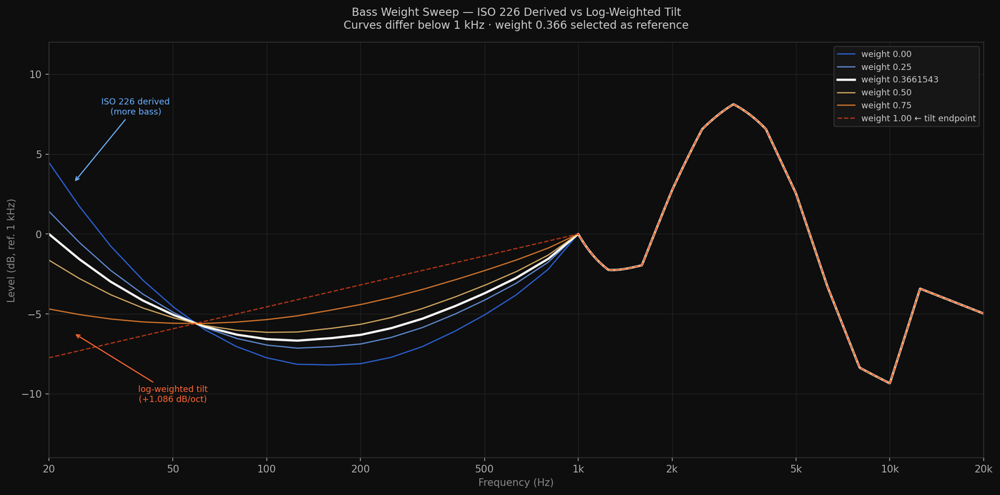
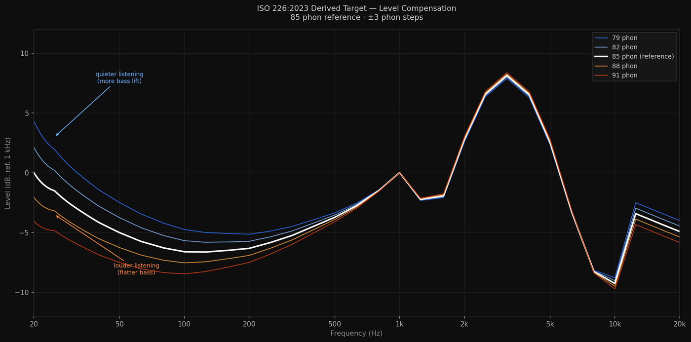

# The ISO 226:2023 Headphone Target

**A perceptually optimized EQ framework that scales with the biology of human hearing.**



Most headphone targets (such as Harman) are static averages of subjective listener preferences. This project takes a physiological approach. By deriving a target strictly from the **ISO 226:2023 equal-loudness contours**, this framework delivers a perceptually flat, energy-balanced response that minimizes auditory masking and preserves midrange clarity at natural listening volumes.

## 🧠 The Theory: Under the Hood

### 1. The Biological Baseline (ISO 226:2023)

Human hearing is non-linear; we are highly sensitive to mid-frequencies (where human speech lives) and significantly less sensitive to sub-bass and extreme treble. This target uses the latest ISO 226:2023 data at an **85-phon reference level** to map exactly how much acoustic pressure is required at every frequency for the brain to perceive the spectrum as equally loud.

### 2. Pinna Gain Inversion & Energy Balancing

Applying raw equal-loudness contours directly to headphones results in a skewed response because headphones bypass the outer ear, lacking the natural acoustic interaction of a physical room. To correct this, the target **inverts the sensitivity data above 1 kHz** to properly reconstruct the required pinna gain area.

Combined with **adaptive shaping and spectral tilt**, this mathematically balances the total acoustic energy across the frequency spectrum while maintaining the integrity of the ISO baseline.

### 3. The "Optimal" Coefficient: 0.3661543

Bass tuning is a battle against **auditory masking**, where excessive low-frequency energy bleeds into and obscures the lower midrange. To solve this, I defined a boundary range between two extreme profiles:

* **`headphone_target_0.00.csv`**: The "Clinical Floor"—the absolute mathematical minimum of the bass shelf.
* **`headphone_target_1.00.csv`**: The "Maximum Ceiling"—the maximum saturation of the bass shelf.

The family of curves was generated by calculating a **weighted linear interpolation** between these two boundaries. If $w$ is the weight (coefficient) and $C$ represents the frequency response curve:

$$Target_{w} = (1 - w) \cdot C_{0.00} + w \cdot C_{1.00}$$

Through extensive A/B listening validation and polynomial regression analysis ($R^2 = 0.999613$), I identified the specific point of diminishing returns. The value **0.3661543** is the optimal coefficient: it provides maximum low-end authority at the exact threshold before auditory masking compromises midrange clarity, keeping vocals and instruments pristine.

## 🎧 The Calibration Ritual: "The Sandwich"

The provided 0.3661543 optimal target is calibrated to **85 phon** (which correlates to 85 dBA, the NIOSH standard for safe 8-hour listening). 

Because the sensitivity of every headphone varies, you should calibrate your hardware so your physical listening volume matches the math. 

**The Workflow:**
1. **Reference Signal:** Play a **Pink Noise** generator through your system.
2. **The Measurement:** Place a measurement device (e.g., an iPhone running *Decibel X*) sandwiched snugly between your earcups to mimic the seal against your head.
3. **The Calibration:** Adjust your amplifier/interface volume until the meter reads a steady **85 dBA**.
4. **The Baseline:** Your setup is now calibrated to the 85-phon reference. At this volume level, the EQ curve will perform exactly as engineered to prevent masking.

> **Note:** You should repeat this quick calibration step whenever you switch to a different pair of headphones with a different impedance/sensitivity.

## 🎛️ The Included Curves

All provided CSV files are **0 dB normalized at 1 kHz** and calculated for the **85-phon** reference level.

| Target File | Bass Shelf Weight | Description |
| :--- | :--- | :--- |
| `headphone_target_0.00.csv` | 0.00 | The absolute mathematical floor of the bass transition. |
| `headphone_target_0.25.csv` | 0.25 | Reduced low-end weight. |
| **`headphone_target_0.3661543.csv`** | **0.366** | **The Solved Baseline. Maximum low-end authority with zero midrange masking at 85 phon.** |
| `headphone_target_0.50.csv` | 0.50 | Elevated low-end weight. |
| `headphone_target_0.75.csv` | 0.75 | Heavy low-end weight. |
| `headphone_target_1.00.csv` | 1.00 | The mathematical ceiling of the bass transition. |

> [!WARNING]
> **A Note on Listening Volume:**
> The optimal **0.3661543** curve provided above is engineered *specifically* for an 85-phon listening level. Because human hearing sensitivity shifts dramatically with volume, this target will not be perceptually accurate at significantly lower or higher volumes. 
> 
> If you prefer to listen at a quieter or louder volume, **do not just pick a different CSV file from the table.** Instead, use the included `gentarget.py` tool to generate a mathematically accurate curve tailored to your exact listening level.

## 🛠️ The Toolkit

This repository includes custom Python tools to generate dynamic targets and perform accurate psychoacoustic A/B testing.

### 1. gentarget.py — Custom ISO Target Generator



Generate targets scaled to any phon level, or derive a custom ISO-based target from raw headphone measurements or existing target curves like Harman.

**Usage:**
```bash
# Standard optimal target at 85 phon
python gentarget.py --phon 85

# Target adjusted for a quieter listening level (e.g., 75 phon)
python gentarget.py --phon 75

# Derive an ISO-corrected target from your own headphone's raw measurement CSV
python gentarget.py --phon 82 --input my_headphone_raw.csv

# Change reference frequency from the 1000 Hz default
python gentarget.py --phon 85 --ref 500

```

**Arguments:**

* `-p`, `--phon` : Target loudness in phon (Default: 85)
* `-r`, `--ref` : Reference frequency for 0 dB normalization (Default: 1000)
* `-i`, `--input` : Optional CSV to derive a custom target from
* `-b`, `--base-phon` : Phon level of the input curve (Default: 85)

### 2. volume_match.py — Psychoacoustic Loudness Matcher

Switching between EQ profiles often changes the overall perceived volume, which invalidates A/B testing (the brain naturally prefers the louder signal). This script automatically adjusts the Preamp of a target EQ profile to match the perceived loudness of your source profile using A-weighting and power summation.

**Usage:**

```bash
python volume_match.py source_eq.txt target_eq.txt

```

*Outputs a new file (`target_eq_volume_matched.txt`) with a mathematically corrected Preamp value. Works flawlessly with Acoustiq, Equalizer APO, Peace, and AutoEQ text profiles.*

## 🚀 Quick Start

1. Download **`headphone_target_0.3661543.csv`**.
2. Load the file as a custom target in Acoustiq, AutoEQ, or REW alongside your headphone's raw measurement to generate your EQ filters.
3. Import those generated filters into your preferred DSP (SoundSource, Equalizer APO, Roon, etc.).
4. Calibrate your amplifier to 85 dBA using pink noise.

### Requirements (For Python Tools Only)

If you wish to use the Python scripts to generate custom phon levels, install the dependencies:

```bash
pip install numpy

```

### License

MIT

```
